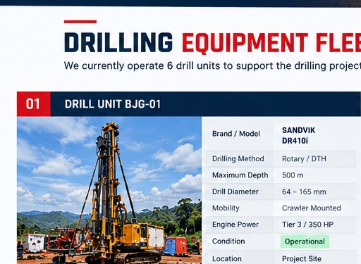

# Balantang Jaya Global — Company Website

> **Reliable Solutions. Safe Execution. Quality Results.**

Official corporate profile and portfolio website for **Balantang Jaya Global**, a Drilling & Construction company.

- Production: https://balantangjaya.com
- Repository: https://github.com/Aditmawaa/balantang-jaya-global
- Hosting: GitHub Pages
- DNS: Rumahweb
- Stack: HTML5, CSS3, Vanilla JavaScript

---

## 1. Project Purpose

This website is a lightweight corporate portfolio designed for potential clients, project owners, contractors, procurement teams, project management teams, HSE teams, and business partners.

The communication strategy is:

**Identity → Services → Project Evidence → Equipment → HSE → Gallery → Contact**

The site emphasizes operational capability, equipment readiness, project execution, safety, quality, and professional coordination.

---

## 2. Technology Architecture

The project deliberately uses a static architecture:

```text
HTML5
  ↓
Page structure + content

CSS3
  ↓
Layout + visual design + responsive behavior

Vanilla JavaScript
  ↓
Navigation + UI interactions + animations

Assets
  ↓
Logo + images + documents

GitHub Pages
  ↓
Static hosting

Custom Domain
  ↓
balantangjaya.com
```

No React, Vue, Angular, PHP, MySQL, or backend server is required for the current scope.

This keeps the site inexpensive, fast, portable, and easy to maintain.

---

## 3. Repository Structure

```text
balantang-jaya-global/
├── index.html
├── css/
│   └── style.css
├── js/
│   └── script.js
├── assets/
│   ├── logo/
│   │   └── logo-balantang-jaya-enhanced.png
│   ├── images/
│   │   ├── equipment/
│   │   │   ├── BJG-01.jpg
│   │   │   ├── BJG-02.jpg
│   │   │   ├── BJG-03.jpg
│   │   │   ├── BJG-04.jpg
│   │   │   ├── BJG-05.jpg
│   │   │   └── BJG-06.jpg
│   │   └── gallery/
│   │       ├── 01-drilling-operation.jpg
│   │       ├── 02-drilling-crew.jpg
│   │       ├── 03-operator-control.jpg
│   │       ├── 04-drill-rod-handling.jpg
│   │       ├── 05-core-sample.jpg
│   │       ├── 06-site-setup.jpg
│   │       ├── 07-project-site-overview.jpg
│   │       ├── 08-survey-coordination.jpg
│   │       ├── 09-equipment-maintenance.jpg
│   │       └── 10-toolbox-meeting.jpg
│   └── documents/
│       └── Balantang_Jaya_Global_Company_Profile_2026.pdf
├── CNAME
└── README.md
```

---

## 4. HTML Logic — `index.html`

The site is a single-page corporate website. Major sections are connected with HTML IDs.

```html
<a href="#about">About</a>
<a href="#services">Services</a>
<a href="#projects">Projects</a>
<a href="#equipment">Equipment</a>
<a href="#hse">HSE</a>
<a href="#gallery">Gallery</a>
<a href="#contact">Contact</a>
```

The corresponding sections use:

```html
<section id="about">
<section id="services">
<section id="projects">
```

No routing framework is required.

### Page flow

```text
Header
  ↓
Hero
  ↓
About
  ↓
Services
  ↓
Project Experience
  ↓
Equipment Fleet
  ↓
HSE
  ↓
Project Gallery
  ↓
Capability
  ↓
Client / Project Partner
  ↓
Contact
  ↓
Footer
```

---

## 5. Hero Logic

The hero answers three questions immediately:

**Who?**  
Balantang Jaya Global

**What?**  
Drilling & Construction

**What is the main message?**  
Reliable Solutions. Safe Execution. Quality Results.

Key statistics are presented as visual anchors:

```text
300  → Drilling Points
6    → Drill Units
2026 → Project Period
```

These numbers should always be updated when official project information changes.

---

## 6. About Section

The About section establishes company identity after the hero.

Content logic:

```text
Company identity
      ↓
Business field
      ↓
Operational approach
      ↓
Execution capability
```

The current messaging focuses on:

- Project planning
- Competent personnel
- Fit-for-purpose equipment
- HSE controls
- Disciplined execution

Avoid unsupported claims such as certification, license, employee count, or years of operation unless verified.

---

## 7. Services Logic

The service cards are reusable components.

Current categories:

```text
01 — Drilling Services
02 — Construction
03 — Project Support
```

A card follows the pattern:

```html
<article class="card">
    <i>01</i>
    <h3>Service Name</h3>
    <p>Service description.</p>
</article>
```

A new service can be added by duplicating the component and updating its content.

---

## 8. Project Experience Logic

The project section is the primary proof-of-experience section.

Current reference:

```text
Client: Trinusa Resource
Scope: 300 Drilling Points
Period: August — November 2026
Status: In Progress
```

Project metadata is deliberately separated into:

```text
OWNER / CLIENT
PERIOD
SCOPE
STATUS
```

This makes the information easy for procurement and project personnel to scan.

### Status update

When officially completed:

```html
IN PROGRESS
```

can become:

```html
COMPLETED
```

Only use verified project status.

---

## 9. Equipment Logic

Equipment uses reusable fleet cards.

Each card contains:

```text
Unit ID
↓
Image
↓
Brand / Model
↓
Method
↓
Maximum Depth
↓
Drill Diameter
↓
Engine Power
↓
Status
```

Example data structure:

```text
BJG-01
SANDVIK DR410i
Rotary / DTH
500 m
64–165 mm
Tier 3 / 350 HP
Operational
```

Equipment specifications must be verified against official fleet records before publication.

---

## 10. HSE Logic

HSE is separated visually as a major corporate section.

Current principles:

```text
01 Risk Management
02 Safe Work
03 Competency
04 Environment
```

Conceptual workflow:

```text
Identify hazards
      ↓
Establish controls
      ↓
Apply safe work procedures
      ↓
Use competent personnel
      ↓
Control environmental impacts
```

The website communicates HSE principles; it does not replace official HSE procedures, RA/JSA, SOPs, or site rules.

---

## 11. Gallery Logic

Gallery items use the semantic structure:

```html
<figure>
    
    <figcaption>...</figcaption>
</figure>
```

Current categories include:

- Drilling Operation
- Drilling Crew
- Operator Control
- Drill Rod Handling
- Core Sample
- Site Setup
- Project Site Overview
- Survey & Coordination
- Equipment Maintenance
- Toolbox Meeting

Illustrative/mockup images must not be presented as official project photographs.

When official photographs become available:

```text
Official photo
  ↓
Permission check
  ↓
Optimize image
  ↓
Rename
  ↓
Upload to gallery
  ↓
Update HTML
  ↓
Test
  ↓
Commit
```

---

## 12. Capability Logic

The capability section explains how the company executes projects, not just what equipment it owns.

### Manpower & Organization

Potential roles:

- Project leadership
- Drilling operators
- Mechanics
- Field coordinators
- HSE personnel
- Supporting crews

### Supporting Equipment

Potential categories:

- Light vehicles
- Site transportation
- Generator
- Workshop tools
- Material handling equipment

### Project Control

Includes:

- Daily progress monitoring
- Equipment readiness
- HSE reporting
- Client coordination

Only publish actual manpower numbers or assets after verification.

---

## 13. Client / Project Partner Logic

Current project reference:

```text
TRINUSA RESOURCE
300 DRILLING POINTS
August — November 2026
```

Client logos, confidential information, documents, and project photographs should only be published when authorization exists.

---

## 14. Contact Logic

The contact section is the final conversion point:

```text
Visitor learns about company
        ↓
Reviews services
        ↓
Reviews project/equipment
        ↓
Reviews HSE
        ↓
Reaches Contact
        ↓
Business enquiry
```

Recommended business email:

```text
info@balantangjaya.com
```

Possible future aliases:

```text
project@balantangjaya.com
hse@balantangjaya.com
admin@balantangjaya.com
finance@balantangjaya.com
```

---

## 15. CSS Logic — `css/style.css`

CSS controls:

- Brand colors
- Typography
- Spacing
- Grids
- Cards
- Header
- Hero
- Buttons
- Equipment
- Gallery
- HSE
- Contact
- Responsive layout
- Animations

The visual direction is:

```text
Industrial
Corporate
Engineering
Professional
Safety-focused
```

Use CSS variables for global colors:

```css
:root {
    --navy: ...;
    --red: ...;
    --white: ...;
    --soft: ...;
    --muted: ...;
    --line: ...;
}
```

This allows a global brand-color change without editing every component.

---

## 16. Responsive Design Logic

The layout follows:

```text
Desktop
3 / 4 column grids
       ↓
Tablet
2 column grids
       ↓
Mobile
1 column
```

Media queries control:

- Navigation
- Grid columns
- Typography
- Padding
- CTA layout
- Contact layout
- Equipment cards

Always test both desktop and mobile after major CSS changes.

---

## 17. JavaScript Logic — `js/script.js`

JavaScript is intentionally lightweight.

Its role is UI behavior, not business logic.

Typical flow:

```text
Page loads
   ↓
Initialize UI
   ↓
Mobile menu listener
   ↓
Open / close navigation
   ↓
Scroll interaction
   ↓
Animation / visual interaction
```

No database, authentication, or API is required.

---

## 18. Why Vanilla JavaScript?

A framework is unnecessary for the current website because there is:

- No database
- No authentication
- No complex application state
- No backend
- No API dependency
- Mostly static content

Using Vanilla JavaScript keeps the deployment simple and compatible with GitHub Pages.

---

## 19. Asset Management

Assets are separated by function:

```text
assets/logo/
assets/images/equipment/
assets/images/gallery/
assets/documents/
```

Use descriptive filenames.

Good:

```text
BJG-01.jpg
01-drilling-operation.jpg
10-toolbox-meeting.jpg
```

Avoid:

```text
IMG_9823.jpg
final-final-photo.jpg
image123.jpg
```

---

## 20. SEO Logic

The HTML `<head>` contains:

```html
<title>Balantang Jaya Global | Drilling & Construction</title>

<meta
    name="description"
    content="Balantang Jaya Global — Drilling & Construction Company Portfolio"
>
```

Use meaningful:

- Page title
- Description
- Image `alt`
- Heading hierarchy

Avoid keyword stuffing.

---

## 21. Accessibility Logic

Images should contain descriptive alt text:

```html

```

Navigation buttons should have understandable labels:

```html
<button aria-label="Toggle navigation">
```

Maintain sufficient contrast between text and background.

---

## 22. Custom Domain Architecture

The website separates domain, hosting, and email:

```text
                    balantangjaya.com
                            │
                            ▼
                       Rumahweb DNS
                            │
              ┌─────────────┴─────────────┐
              │                           │
              ▼                           ▼
        GitHub Pages                  Titan Mail
              │                           │
              ▼                           ▼
          Website                    Business Email
```

### Website DNS

Apex domain:

```text
A  @  185.199.108.153
A  @  185.199.109.153
A  @  185.199.110.153
A  @  185.199.111.153
```

WWW:

```text
CNAME  www  aditmawaa.github.io
```

Do not add the repository path to the CNAME target.

---

## 23. CNAME File

The repository contains:

```text
CNAME
```

For the apex domain:

```text
balantangjaya.com
```

The CNAME file should contain only the domain value.

---

## 24. Titan Mail Logic

Email is independent from GitHub Pages.

```text
A / CNAME
    ↓
Website

MX
    ↓
Titan Mail

TXT / SPF / DKIM / DMARC
    ↓
Email authentication
```

Do not remove the GitHub Pages A records when adding Titan Mail.

---

## 25. Deployment Logic

Recommended deployment flow:

```text
Edit
  ↓
Test locally
  ↓
git add .
  ↓
git commit
  ↓
git push
  ↓
GitHub Pages
  ↓
balantangjaya.com
```

Check:

**Repository → Settings → Pages**

to confirm the active publishing branch and folder.

The repository currently shows the branch:

```text
Aditmawaa-version-2
```

Always verify the active Pages source before changing branches.

---

## 26. Local Development

Open `index.html` directly for a quick test.

For a local HTTP server:

```bash
python -m http.server 8000
```

Then:

```text
http://localhost:8000
```

This is useful for catching asset/path problems.

---

## 27. Git Workflow

Clone:

```bash
git clone https://github.com/Aditmawaa/balantang-jaya-global.git
```

Enter:

```bash
cd balantang-jaya-global
```

Check:

```bash
git status
```

Create branch:

```bash
git checkout -b update-company-profile
```

Stage:

```bash
git add .
```

Commit:

```bash
git commit -m "Update company profile"
```

Push:

```bash
git push origin update-company-profile
```

---

## 28. Recommended Commit Messages

Use specific messages:

```text
Update project status
Add BJG-07 equipment
Replace project gallery photos
Update company contact information
Improve mobile navigation
Update company profile PDF
```

Avoid vague messages such as:

```text
update
fix
test
```

---

## 29. Adding Equipment

Add the image:

```text
assets/images/equipment/BJG-07.jpg
```

Then duplicate an existing `.fleet-card` and update:

```text
Unit ID
Model
Method
Depth
Diameter
Power
Status
```

Verify all technical specifications before deployment.

---

## 30. Adding Gallery Photos

Add:

```text
assets/images/gallery/11-new-project-photo.jpg
```

Then add:

```html
<figure>
    
    <figcaption>
        <b>11</b>Project Activity
    </figcaption>
</figure>
```

---

## 31. Updating Contact

Example email:

```html
<a href="mailto:info@balantangjaya.com">
    info@balantangjaya.com
</a>
```

WhatsApp:

```html
<a href="https://wa.me/628XXXXXXXXXX">
    WhatsApp
</a>
```

Use the international number without `+`, spaces, or hyphens.

---

## 32. Security Rules

Never commit:

```text
Passwords
API keys
GitHub tokens
Email passwords
Database credentials
Private keys
```

Do not put secrets inside:

```text
index.html
style.css
script.js
README.md
```

The current static site has no server-side secrets.

---

## 33. Content Verification

Before publishing company information:

```text
Information
    ↓
Verify official record
    ↓
Check authorization
    ↓
Update source
    ↓
Test
    ↓
Commit
    ↓
Deploy
```

Especially verify:

- Client names
- Project status
- Project location
- Equipment specifications
- Certifications
- Licenses
- Contact details
- Employee information
- Company statistics

---

## 34. Performance Strategy

The site is designed to remain lightweight:

```text
No framework
     ↓
Minimal JavaScript
     ↓
Optimized images
     ↓
Static assets
     ↓
GitHub Pages
```

Optimize large photographs before upload.

Recommended formats:

```text
WebP
JPEG
PNG (when transparency is required)
```

---

## 35. Production Checklist

Before every public update:

```text
[ ] Company data verified
[ ] Project data verified
[ ] Client information approved
[ ] Equipment data verified
[ ] Contact data verified
[ ] Gallery images approved
[ ] No confidential data exposed
[ ] Desktop tested
[ ] Mobile tested
[ ] Navigation tested
[ ] Images tested
[ ] PDF tested
[ ] Custom domain tested
[ ] HTTPS tested
```

---

## 36. Future Roadmap

### V5 — Official Corporate Data

- Legal company information
- Office address
- Organization chart
- Certifications
- Licenses
- Official fleet records
- Official project photographs

### V6 — Multi-page Website

```text
/
├── about/
├── services/
├── projects/
├── equipment/
├── hse/
├── gallery/
├── downloads/
└── contact/
```

### V7 — Business Features

- Contact form
- Inquiry form
- Recruitment
- News
- Analytics
- Search Console
- Download center
- CMS

---

## 37. Why This Architecture?

The current business requirement does not require:

```text
Database
Backend
Authentication
API
CMS
Complex state management
```

Therefore:

```text
HTML + CSS + JS
        +
GitHub Pages
        +
Custom Domain
        +
Titan Mail
```

is sufficient.

This provides:

- Low infrastructure cost
- Simple maintenance
- Fast deployment
- Easy backup
- Easy portability
- Minimal technical overhead

---

## 38. Ownership

Current repository:

```text
Aditmawaa/balantang-jaya-global
```

For long-term company ownership, consider eventually moving the repository into a GitHub Organization controlled by Balantang Jaya Global.

---

## 39. Version History

Recommended major releases:

```text
V1 — Initial company portfolio
V2 — Project gallery
V3 — Equipment fleet + gallery
V4 — Capability + client + company profile
V5 — Official company data + real photographs
V6 — Multi-page corporate website
```

Git tags can be used:

```bash
git tag v1.0
git tag v2.0
git tag v3.0
git tag v4.0
```

---

## 40. Final Architecture

```text
                         INTERNET
                            │
                            ▼
                  balantangjaya.com
                            │
                            ▼
                      RUMAHWEB DNS
                            │
              ┌─────────────┴─────────────┐
              │                           │
              ▼                           ▼
        GITHUB PAGES                  TITAN MAIL
              │                           │
              ▼                           ▼
        Static Website              Business Email
              │
       ┌──────┼──────┐
       ▼      ▼      ▼
      HTML    CSS     JS
       │
       └────── Assets
              ├── Logo
              ├── Equipment
              ├── Gallery
              └── Company Profile PDF
```

---

## 41. Maintainer Procedure

When modifying the project:

1. Identify the required business change.
2. Verify the source information.
3. Edit the correct layer.
4. Test locally.
5. Test desktop.
6. Test mobile.
7. Check links and images.
8. Commit with a descriptive message.
9. Push to GitHub.
10. Verify GitHub Pages deployment.
11. Verify `https://balantangjaya.com`.
12. Keep a backup.

---

## 42. Important Business Rule

This repository is a **company presentation system**, not merely a visual website.

Therefore, every public claim should be treated as business information.

Before publishing:

```text
Correct
+
Verified
+
Authorized
=
Production Content
```

---

## Official References

- GitHub Pages: https://docs.github.com/en/pages/
- GitHub Pages Quickstart: https://docs.github.com/en/pages/quickstart
- GitHub Pages custom domains: https://docs.github.com/en/pages/configuring-a-custom-domain-for-your-github-pages-site/managing-a-custom-domain-for-your-github-pages-site
- GitHub Pages publishing source: https://docs.github.com/en/pages/getting-started-with-github-pages/configuring-a-publishing-source-for-your-github-pages-site

---

## Maintainer

**Balantang Jaya Global**

**Drilling & Construction**

Website: https://balantangjaya.com

Repository: https://github.com/Aditmawaa/balantang-jaya-global
